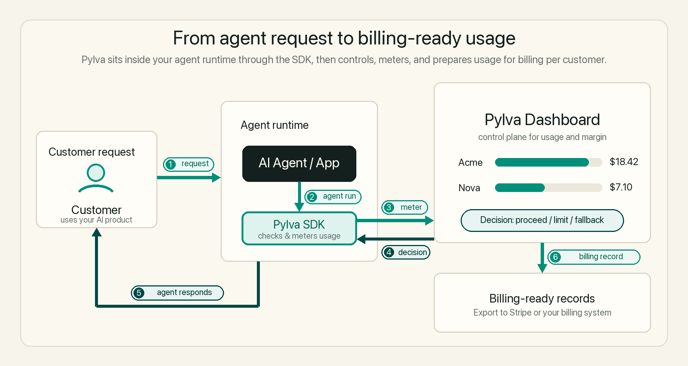
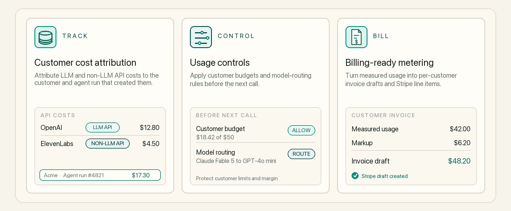

# Pylva

Open-source Paid.ai alternative for AI agent companies.

Monetize and scale AI agents with customer-level cost tracking, usage controls, and billing-ready metering you can self-host.

<p align="center">
  
</p>

<p align="center">
  <a href="https://docs.pylva.com"><b>Documentation</b></a>
  &nbsp;&middot;&nbsp;
  <a href="https://github.com/Pylva/pylva/issues/new?template=feature_request.yml"><b>Feature Requests</b></a>
  &nbsp;&middot;&nbsp;
  <a href="https://github.com/Pylva/pylva/issues/new?template=bug_report.yml"><b>Report Bug</b></a>
</p>

<p align="center">
  <a href="https://pylva.com"></a>
  <a href="#self-host-pylva"></a>
  <a href="https://join.slack.com/t/pylva/shared_invite/zt-4357amddc-QvNEhpxYU~6DyrF5P6Cw8Q"></a>
  <a href="#works-with-your-agent-stack"></a>
  <br />
  
  
  
  <a href="#license"></a>
</p>

## Core Features

<p align="center">
  
</p>

## Get started with Pylva Cloud

1. 👋 **Sign in to Pylva** at [pylva.com](https://pylva.com/login).

2. 🤖 **Give this prompt to your coding agent.**

   ```text
   Read https://docs.pylva.com/setup-with-ai.md and integrate Pylva into this
   project. Follow it exactly. Only ask me for the steps marked HUMAN ACTION
   (signing in and pasting an API key).
   ```

3. 🎉 **You’re connected.** Open [your Pylva dashboard](https://pylva.com) to see your first event.

## Self-host Pylva

**Same product. Your infrastructure.**

Run Pylva locally from source with Docker-managed PostgreSQL, ClickHouse, and Redis.

1. 📦 **Clone Pylva.**

   ```bash
   git clone https://github.com/Pylva/pylva.git
   cd pylva
   ```

2. 🚀 **Start Pylva.**

   ```bash
   docker compose -f docker/docker-compose.yml up -d
   pnpm install
   cp .env.example .env
   pnpm exec tsx scripts/generate-dev-keys.ts
   pnpm db:setup && pnpm db:seed
   pnpm exec next dev --port 3000
   ```

3. 🎉 **Open Pylva.** Go to [http://localhost:3000](http://localhost:3000).

## Works with your agent stack

**Pylva is provider-agnostic and framework-independent.** Track every API cost generated by your agent and attribute it to the customer who generated it.

| Your stack | What Pylva supports | Examples |
|---|---|---|
| **LLM APIs** | Track usage from any LLM provider or model per customer. | OpenAI, Anthropic, DeepSeek, Gemini, Mistral |
| **Non-LLM APIs** | Track any non-LLM API per customer using the unit that provider bills you for. | ElevenLabs, Pinecone, Deepgram, Replicate |
| **Agent architecture** | Works with custom and framework-based agents. No framework is required. | Custom agents, LangGraph integration |
| **SDKs & languages** | Integrate using Pylva's first-party SDKs. | TypeScript, Python |

Pylva tracks usage at the API layer, so your agent does not need a particular framework. Use automatic instrumentation where available or direct usage reporting for any other LLM or non-LLM API.

## Privacy & Data

**Meter costs without collecting agent conversations.** Pylva's automatic instrumentation records the usage metadata needed for attribution, controls, and billing-ready metering.

| Data area | Pylva behavior |
|---|---|
| **Usage metadata** | Records provider, model, token counts, latency, status, customer ID, step name, and configured non-LLM usage metrics. |
| **Agent content** | Does not automatically collect prompts, completions, messages, or tool inputs and outputs. |
| **Self-hosted deployments** | Do not phone home to Pylva. Optional PostHog analytics remain off unless you configure them, and Next.js telemetry is disabled. |
| **Builder-provided fields** | Customer IDs, step names, and custom metadata are not automatically redacted. Use identifiers rather than personal data or raw user content. |

## Community & Contributing

Pylva improves through feedback and contributions from AI agent builders.

- **Discuss:** [Join the Pylva Slack community](https://join.slack.com/t/pylva/shared_invite/zt-4357amddc-QvNEhpxYU~6DyrF5P6Cw8Q).
- **Contribute:** Read [CONTRIBUTING.md](CONTRIBUTING.md) for local development, testing, and pull request guidance.
- **Issues:** [Open or browse GitHub issues](https://github.com/Pylva/pylva/issues) for bugs, feature requests, and self-hosting questions.

## License

Pylva uses a path-based license model.

- **MIT:** The product core is licensed under [MIT](LICENSE).
- **Elastic License 2.0:** The Bill pillar paths listed in [LICENSE-MAP.md](LICENSE-MAP.md) are licensed under ELv2. See the [full license text](src/ee/LICENSE).
